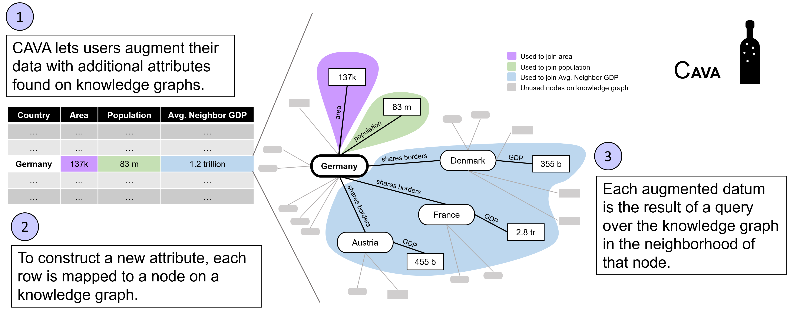

# Columnar data Augmentation through Visual Analytics (CAVA)

This repo holds contains source code for **CAVA**, or Columnar data Augmentation through Visual Analytics, a visual analytics tool for column-wise data augmentation using knowledge graphs.  This work was developed by visual analytics research labs at Tufts University, Georgia Tech, and University of Wisconsin in relation to DARPA's Data Driven Discovery of Models program.

## Read the Paper

A preprint of the paper can be found on arXiv.

[https://arxiv.org/abs/2009.02865](https://arxiv.org/abs/2009.02865)

The paper will be presented at the IEEE Visualization Conference virtually in October 2020.  It will be published in IEEE Transactions on Visualization and Computer Graphics at some point after that.  Thank you to the full list of authors: Dylan Cashman (Tufts), Shenyu Xu (Georgia Tech), Subhajit Das (Georgia Tech), Florian Heimerl (Wisconsin), Cong Liu (Tufts), Shah Rukh Humayoun (San Francisco State), Michael Gleicher (Wisconsin), Alex Endert (Georgia Tech), Remco Chang (Tufts).  Thank you also to all of our collaborators in [DARPA's Data Driven Discovery of Models program](https://gitlab.com/datadrivendiscovery/d3m).

## Repo Summary

The goal of this application is to make it easy to add on additional columns to a tabular dataset by mining knowledge graphs.  Currently, this application only supports connecting to wikidata.

CAVA lets users upload a dataset and then search through wikidata for related attributes of different columns.  For example, if a dataset has a column consisting of U.S. cities, CAVA will return a list of attributes shared by U.S. cities in wikidata, and let the user join them to their CSV and download the augmented dataset.  It also supports more complex augmented attributes, like joining a country's average neighbor GDP.

CAVA consists of a front end user interface that lives in the browser, and a backend server that preprocesses data and calls out to the knowledge graph.  Both front and backend need to be served in order to use CAVA.

This application contains a vueJS, nodeJS, and python project.  In includes some legacy code from a larger application that included more data exploration and connection to a machine learning backend, but it has been pared down to only focus on column data augmentation.  It has a web server done in node.js.  It also contains some data processing scripts, in `lib/external`, that are called through node's `child_process` [library](https://nodejs.org/api/child_process.html).  This node project includes a frontend in vueJS that communicates with the server.

This is the Summer 2020 version, and is not currently being developed or supported.  Feel free to fork this and usethis in your own research.  

## Installation

Our application is split into two servers: The `node.js` middleware, found in `node_middleware`, and the `vue.js` frontend, found in `vue_frontend`.  You need to run installation commands in both directores.

Once installation is done, test it out.  Two servers need to be run, actually - the node server supporting GRPC and web socket communication, and a server for the vue assets.  They are coupled in a single command.  From the application root,

	bash ta3_search shared/static/local_testing_data/185_baseball

If you run the `ta3_search` bash script without a dataset, the user is able to upload a CSV dataset themselves.

    bash ta3_search

### Node Middleware

All instructions should be run from within the `node_middleware` directory.

We use python3 on the backend to run python scripts in child processes.  You should be able to run CAVA without having python installed, but you may see that some features don't work.

We also require node version >= 8.0.  __If you get an error during the server startup, double check that you have the right node version.__

Assuming you have `pip` installed,

    pip3 install -r python-requirements.txt

Install the node dependencies.

    yarn install

#### Problems with static

You might find that the server reports issues with the 'static' folder.  This folder should be symlinked with the static folder in `shared/`, but sometimes this doesn't come through right in the git repo.  If so, delete the empty file `node_middleware/static`, and then create a new symlink from the `node_middleware/shared` directory

        ln -nfs ../../shared/static staticd

The same thing might occur with the `output/` directory as well.

        ln -nfs ../../shared/output output

### Vue Frontend

All instructions should be run from within `vue_frontend`

Install the node dependencies.

    yarn install

### Potential Docker Installation

The middleware communicates with the frontend over two ports - 3000 for the web front end, and 8080 for the web socket.  Those will need to be opened if this is run in a docker container.  A compatible Dockerfile is included in this repository.

### Contributing

If you'd like to contribute to this repository, please create an issue for discussion, and fork the repository and make a pull request.

### License

This is released under the MIT License.
